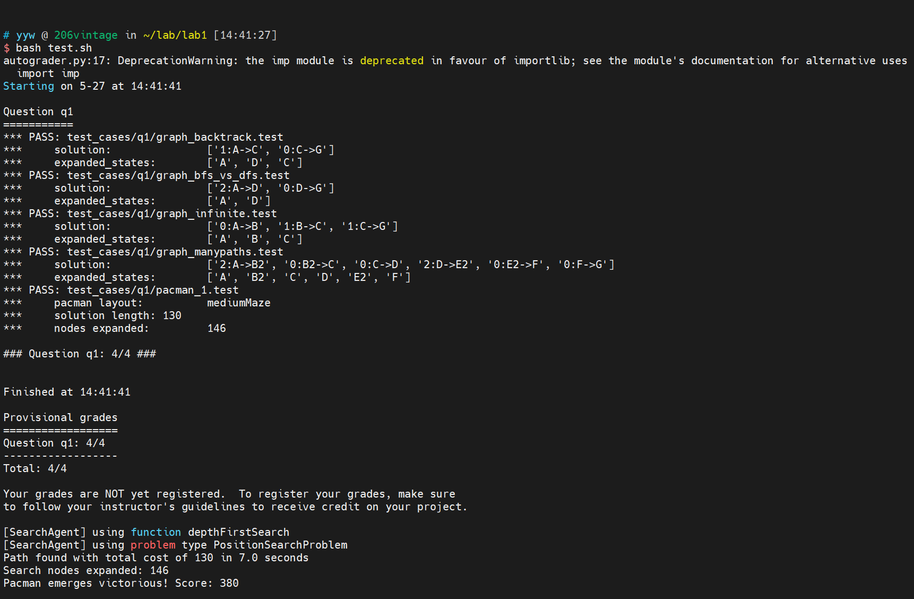

## 实验环境

Python 3.7.3、Kernel 4.19.181-1、Debian 10 (buster)

## 实验内容

### BFS

类似 DFS，使用 `Queue` 来存储访问到的路径，`visited` 字典保存访问到的节点。

每次从队列中弹出节点，若是目标节点，则通过 visited 获取到到达目标节点的路径返回；如果该节点还未访问过，则将该节点加入 visited 中。循环上述过程直至队列为空。

```python
def myBreadthFirstSearch(problem):
    visited = {}
    queue = util.Queue()
    queue.push((problem.getStartState(), None))
    while not queue.isEmpty():
        state, prev_state = queue.pop()
        if problem.isGoalState(state):
            solution = [state]
            while prev_state != None:
                solution.append(prev_state)
                prev_state = visited[prev_state]
            return solution[::-1]
        if state not in visited:
            visited[state] = prev_state
            for next_state, step_cost in problem.getChildren(state):
                queue.push((next_state, state))
    return []
```

### A\*

A\* 算法使用优先队列来排序，按照 f(n)=h(n)+g(n) 排序。与 BFS 类似，每次从优先队列弹出第一个元素，在 `visited` 字典中保存访问的节点，`cost` 字典保存了到每个节点的距离。

初始时 `cost` 字典中只有初始节点，距离是 0；在新节点上使用 `cost[next_state] = cost[state] + step_cost` 记录距离。每次从优先队列弹出节点，若是目标节点则通过 `visited` 找到路径并返回。循环上述过程直至优先队列为空。

```python
def myAStarSearch(problem, heuristic):
    visited = {}
    cost = {}
    pqueue = util.PriorityQueue()
    cost[problem.getStartState()] = 0.0 # start
    pqueue.push((problem.getStartState(), None), heuristic(problem.getStartState()))

    while not pqueue.isEmpty():
        state, prev_state = pqueue.pop()
        if problem.isGoalState(state):
            solution = [state]
            while prev_state != None:
                solution.append(prev_state)
                prev_state = visited[prev_state]
            return solution[::-1]
        if state not in visited:
            visited[state] = prev_state
            for next_state, step_cost in problem.getChildren(state):
                cost[next_state] = cost[state] + step_cost
                pqueue.push((next_state, state), heuristic(
                    next_state)+cost[next_state])
    return []
```

TODO:

### Minimax

源代码:

```python
def minimax(self, state, depth):
```

### Alpha-beta pruning

alpha-beta 剪枝与 Minimax 类似。在遍历的过程中,如果发现 max 节点当前找到的子节点的最大值大于 beta 时，遍历子节点无意义；同理，如果发现 min 节点当前找到的子节点最小值小于 alpha，也可以剪枝。

源代码:

```python
def alphabeta(self,state,depth):
```

## 实验结果

每次测试时运行 `bash test.sh`，test.sh 中测试了三个 search 和两个 agent 的策略

```shell
python3 search/autograder.py -q q1
python3 search/pacman.py -l mediumMaze -p SearchAgent --frameTime 0
python3 search/autograder.py -q q2
python3 search/pacman.py -l mediumMaze -p SearchAgent -a fn=bfs --frameTime 0
python3 search/autograder.py -q q3
python3 search/pacman.py -l mediumMaze -p SearchAgent -a fn=astar,heuristic=manhattanHeuristic --frameTime 0
python3 multiagent/autograder.py -q q2
python3 multiagent/autograder.py -q q3
python3 multiagent/pacman.py -p AlphaBetaAgent -l mediumClassic --frameTime 0
```

所有 case 通过，尽管 agent 时会失败



一些坑：

1. alpha-beta 剪枝中判断当前最大(小)值和 beta(alpha) 的关系时不要用 >=(<=) 而是要用 >(<)。
