## 传统机器学习

### 最小二乘分类

参考 Slides 上的做法，可以使用梯度下降法求解（后面需加上 $\lambda w^2$ 正规化项）

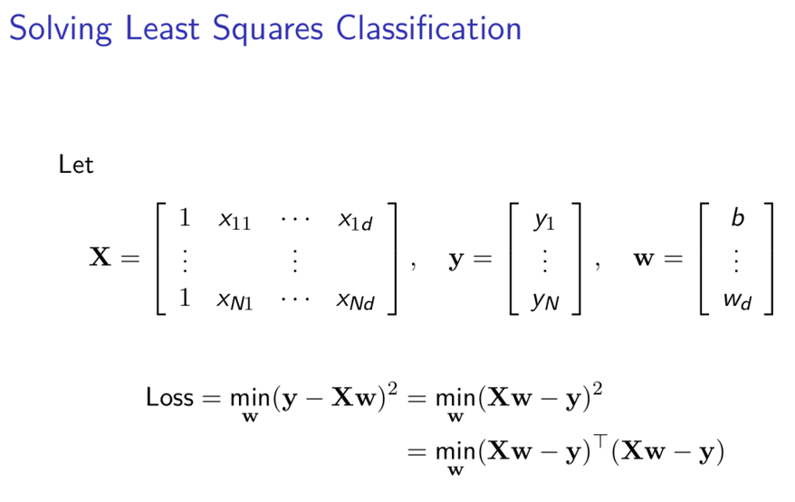

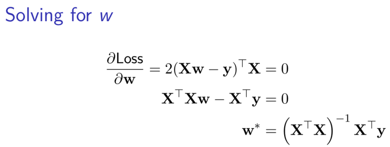

得到迭代式：`w' = w - LearningRate * Partial(Loss/w)`

输出结果如下

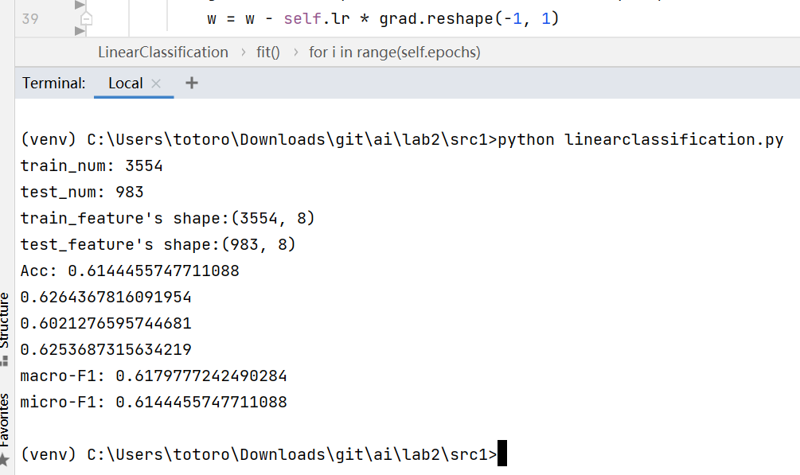

### 朴素贝叶斯

对 feature[0] 使用离散计算频率，feature[1..7] 采用使用正态分布拟合

初始化时遍历整个训练数据集，统计 feature[0] 为 1,2,3 时各个类别的数量和 feature[1..7] 不同分类下的子集 subset_dict

拟合阶段，对离散变量 feature[0] 计算先验概率 P(c) 和条件概率 P(xi|c)，对连续性变量 feature[1..7] 计算各个 subset 的平均值和标准差，得到对应的 Pxc(i, j) 参数分布，通过寻找最大式来得到预测的值

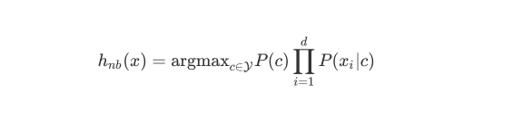

输出结果如下

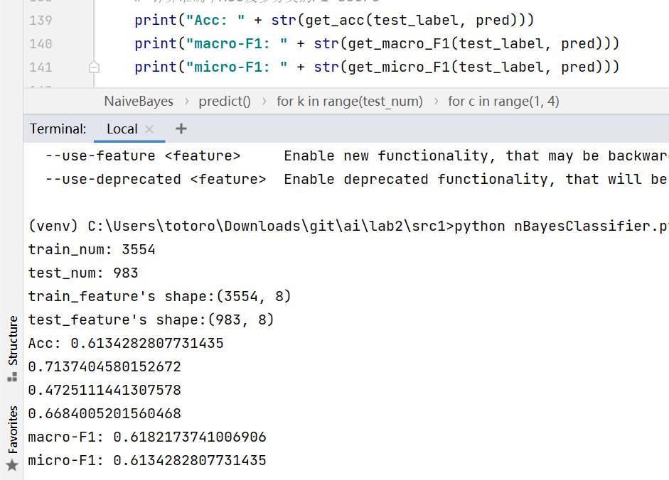

### 支持向量机

根据瓜书和 Slides 上的方法，根据对偶方程解出一组 $\alpha_i$，然后在这里使用 cvxopt 来求解 $\alpha_i$

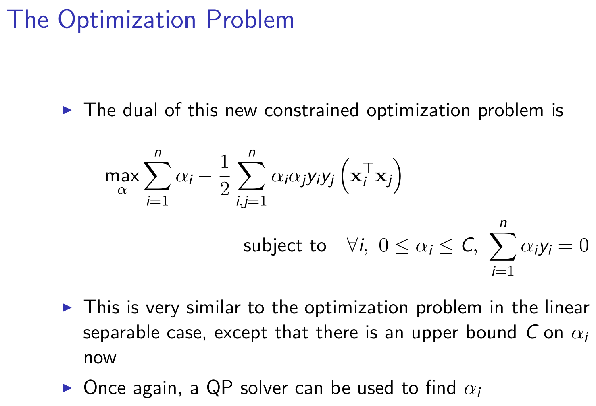

输出结果如下

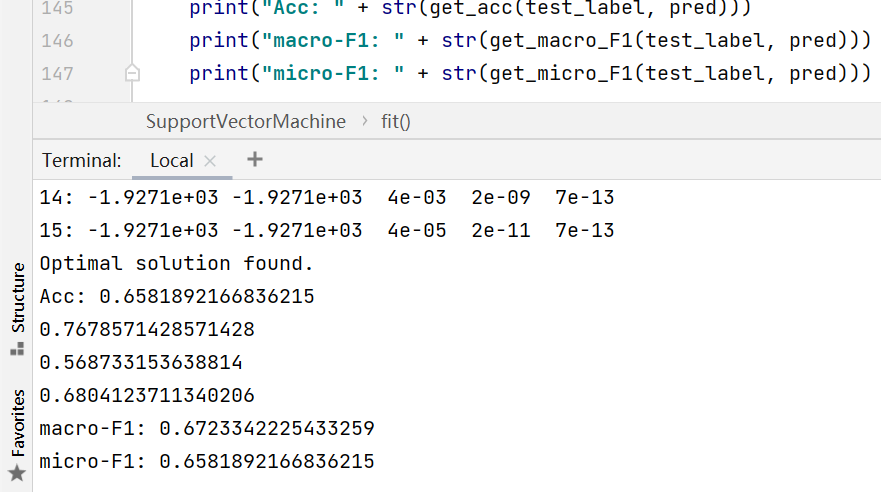

上面是使用 Linear 核的结果

若使用 Poly 核，效果略差于 Linear：

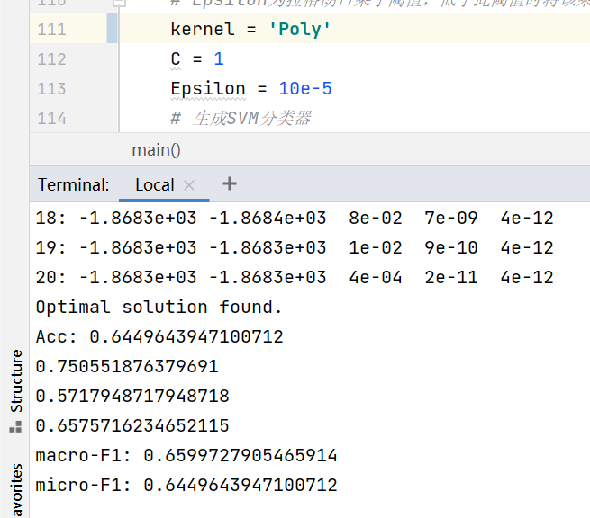

Gauss 核，效果和 Linear 相当：

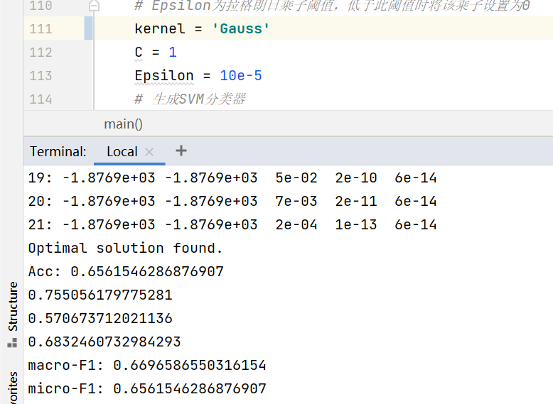

## 深度学习

### 手写感知机模型

我在网上搜寻到的 BP 指的是 w 的迭代公式：<https://zhuanlan.zhihu.com/p/45190898>

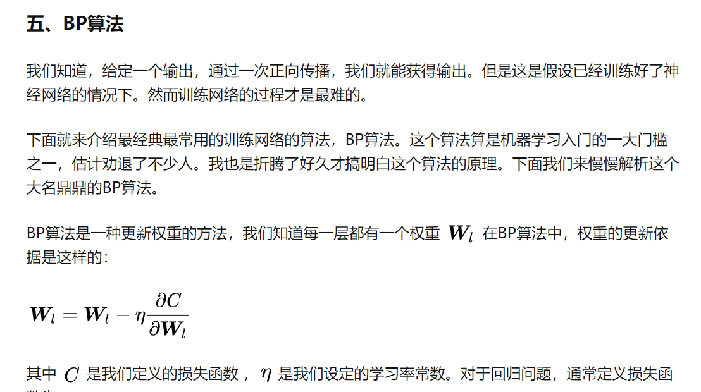

而给的实验指导上是梯度下降公式，我不是很分得清后两点小分的具体要求

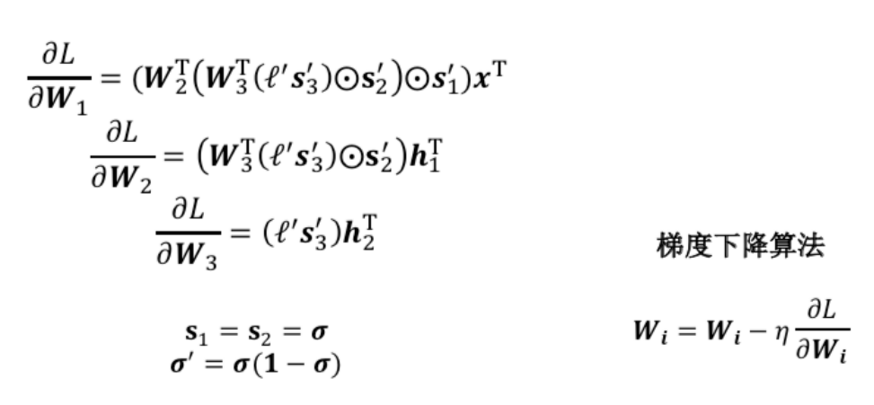

程序最后输出的结果如下

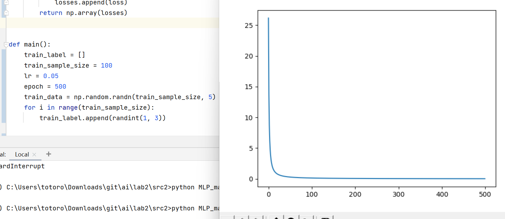

输出的 log(Loss) 如下

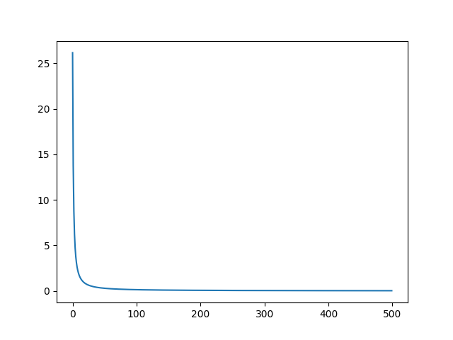

### MLP-Mixer

<del>太难了，看不太懂论文，GitHub 上的没有注释</del>
